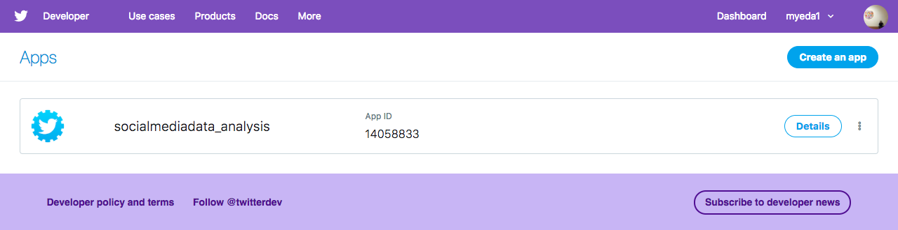
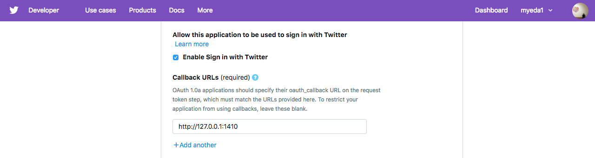
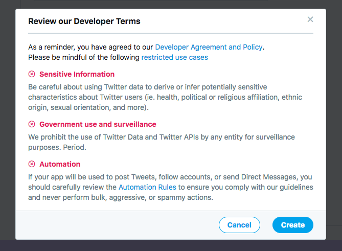
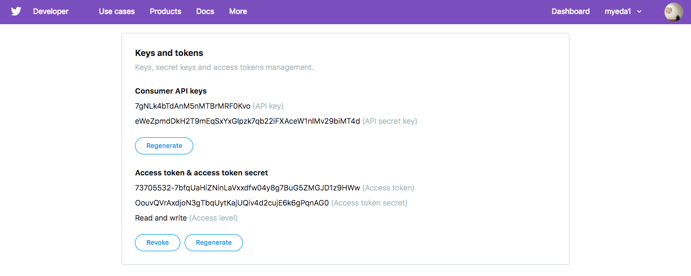

```{r setup, include=FALSE}
knitr::opts_chunk$set(echo = TRUE)
```

# Pengambilan data dengan API {#twitterapi}

Secara teknis API (*Application Programming Interface*) adalah sebuah protokol komunikasi antara dua entitas. Sebagai ilustrasi, saat kita menyimpan sebuah lemari, kemudian lemarinya dikunci dengan sebuah gembok berkode. Maka hanya orang yang telah diberitahu dan mengetahui kombinasi kodenya saja yang bisa mengambil dan menggunakan benda dalam lemari tersebut. Prinsip yang kurang lebih sama diterapkan oleh berbagai perusahaan pengembang teknologi agar para developernya dapat membuat aplikasi dengan memanfaatkan data yang mereka simpan di server. 

Media sosial, seperti Facebook, Youtube, Twitter, dan portal-portal berita biasanya menyediakan API agar publik dapat mengakses apa yang mereka miliki. Tapi API di sini ada yang bersifat gratis, ada yang berbayar. Contohnya Twitter yang menyediakan beberapa tingkat API dengan fasilitas yang berbeda. Untuk lebih lengkapnya, API Twitter dapat dilihat di sini: https://developer.twitter.com/en/pricing. 

Di sini kita akan mencoba menggunakan API BASIC dari Twitter dengan tujuan mendapatkan data aktivitas dan konten yang dilakukan oleh para pengguna Twitter. Namun sebelum berharap lebih jauh, API BASIC hanya bisa menyediakan data: 

1. Sejauh 7-10 hari ke belakang dihitung dari saat penggunaan
2. Tidak bisa mengambil data dalam jumlah banyak
3. Memiliki beberapa keterbatasan fitur aktivitas yang dapat diambil. 

Walaupun demikian, karena kemudahan penggunaannya penggunaan API BASIC merupakan salah satu hal yang bisa bermanfaat. Manfaat tersebut khususnya saat kita hendak melakukan observasi terhadap data di Twitter sebelum melakukan penelitian yang lebih mendalam. Langkahnya adalah sebagai berikut: 

## Membuat API Twitter

Untuk membuat API twitter kita harus memiliki akun Twitter. Selanjutnya menuju ke halaman https://developer.twitter.com/en/apps yang kemudian akan mengarahkan kita ke sebuah laman seperti tampak pada gambar \@ref(fig:api1). Selanjutnya klik tombol `cretae an app` di sebelah kanan. 

```{r api1, echo = FALSE, fig.align='center', out.width = '100%', fig.cap = "Halaman untuk membuat API Twitter"}

```

Pada bagian selanjutnya kita harus mengisi semua kolom yang diwajibkan seperti nama aplikasi, tujuan penggunaan dan lain-lain. Selain kolom yang diwajibkan, pada bagian ini juga kita perlu mengisi kolom `Callback URLs (required)` (lihat gambar \@ref(fig:api2)) dengan `http://127.0.0.1:1410`. 

```{r api2, echo = FALSE, fig.align='center', out.width = '100%', fig.cap = "Pengisian kolom Callback URLs"}

```

Khusus pada bagain kolom `Tell us how this app will be used (required)` kita wajib mengisi tujuan pembuatan aplikasi secara detil. Contohnya adalah: `I am going to use this app to explore social movement on the Internet using Twitter data. In addition, I will also use this application to teach data mining in class.` Setelah semuanya terisi lalu tekan tombol `create` di bagian bawah dan akan memunculkan kota dialog baru seperti gambar \@ref(fig:api3). 

```{r api3, echo = FALSE, fig.align='center', out.width = '100%', fig.cap = "Tombol create API Twitter"}

```

Sampai di sini, kita telah bisa membuat sebuah API Twitter basic. Selanjutnya untuk mendapatkan data dari Twitter kita perlu mendapatkan `Keys and tokens` dengan menekan tombolnya pada halaman baru yang terbuka. Bagian pertama seperti dapat dilihat pada gambar \@ref(fig:api4). 

```{r api4, echo = FALSE, fig.align='center', out.width = '100%', fig.cap = "Mendapatkan Keys and tokens Twitter"}

```

Pada gambar \@ref(fig:api4) terdapat dua bagian yaitu `Consumer API keys` dan `Access token & access token secret`. Namun pada saat pertama halaman ini terbuka bagian kedua masing kosong. Di sana ada tombol create untuk mendapatkan nomor yang dimaksud. Keempat nomor tersebutlah yang selanjutnya akan digunakan setiap kita mau mengambil data dari Twitter dengan menggunakan API BASIC. 

## Mendapatkan Data Twitter {#twitterData}

Setelah berhasil membuat api **basic**, selanjutnya kita sudah bisa mengambil data dari Twitter secara langsung. Pada kesempatan ini kita akan menggunakan paket `rtweet` yang dibuat oleh Michael W. Kearney [-@rtweet-package]. Skrip berikut merupakan langkah pertamanya. 

```{r, eval=FALSE, message=FALSE, warning=FALSE}
# loading the package
library(rtweet)
# create access between R and Twitter
create_token(
  app = "nama api anda",
  consumer_key = "consumer key anda",
  consumer_secret = "consumer secret anda",
  access_token = "access token anda",
  access_secret = "access secret anda")
```

Skrip di atas digunakan untuk memanggil library `rtweet` dan mengatur hubungan dengan API Twitter. Hubungan dengan Twitter diatur dengan menggunakan aplikasi API yang dibuat serta beberapa nomor kuncinya. Nomor kunci tersebut hanya dibuat sekali, namun setiap kali pengambilan data harus dijalankan terlebih dahulu. Selanjutnya, setelah hal tersebut dilakukan kita dapat segera mengambil data dengan menggunakan beberapa fungsi dari `rtweet`. 

### Mendapatkan twit berdasarkan kata kunci

Kata kunci yang dimaksud di sini bisa berupa kata, tagar, atau pun term lain yang terdapat dalam *body* twit (bagian teks dalam sebuah twit). Contohnya skrip berikut digunakan untuk mendapatkan twit yang bukan retweet yang mengandung tagar **tolak212** selama tujuh hari terakhir. 

```{r, eval=FALSE}
# trying to get 18000 tweets containing #Tolak212 hashtag
twitterdata1 <- search_tweets("#Tolak212", n = 18000, include_rts = FALSE)

# menyimpan data yang didapat
# write_rds(twitterdata1, "Data/twitterData1.rds")
```

Fungsi pertama yang digunakan dalam skrip di atas adalah: `search_tweets` yang berguna untuk mencari twit. `n` menunjukkan jumlah twit yang mencoba didapatkan. Sementara `include_rts` merupakan fungsi logical (FALSE/TRUE) yang jika di atur `FALSE` tidak akan mengambil  retweet dan sebaliknya. Di dalam pencarian twit dengan fungsi `search_tweets` juga terdapat beberapa parameter lain yang dapat diterapkan. Misalnya, `type` yang bisa di isi `"recent"`, `"mixed"` dan `"popular"` yang menunjukkan jenis twit yang akan diambil bersifat yang terbaru, atau yang paling populer, atau gabungan. 

> Tantangan: setelah menjalankan skrip untuk mendapatkan data dari twitter, pada bagian environment akan menyimpan data yang bisa didapat. Coba eksplorasi data yang didapat dengan menggunakan pengetahuan yang didapat dari bagian \@ref(fungsidasar), yaitu str(), class(), dan summary(). 

### Mendapatkan *timeline*

Terkadang kita ingin mendapatkan *timeline* dari sebuah atau beberapa akun tertentu. Untuk mendapatkannya kita bisa menggunakan fungsi `get_timelines()` seperti dalam contoh skrip berikut. 

```{r, eval=FALSE, message=FALSE, warning=FALSE}
tmls <- get_timelines(c("cnn", "BBCWorld", "foxnews"), n = 3200)
```

Skrip di atas akan mencari twit yang dikirim oleh tiga akun (cnn, BBCWorld, foxnews) dalam 7 hari terakhir. Di sini kita atur untuk mencoba mendapatkan 3200 twit dari masing-masing akun. Hasil yang didapatkan kemudian bisa langsung di visualisasikan menggunakan skrip berikut. Tapi untuk pembahasan visualisasi lebih lengkapnya akan dibahas pada bagian \@ref(vis). 

```{r, eval=FALSE}
tmls %>%
  # dplyr::filter(created_at > "2017-10-29") %>%
  dplyr::group_by(screen_name) %>%
  ts_plot("days", trim = 1L) +
  ggplot2::geom_point() +
  ggplot2::theme_minimal() +
  ggplot2::theme(
    legend.title = ggplot2::element_blank(),
    legend.position = "bottom",
    plot.title = ggplot2::element_text(face = "bold")) +
  ggplot2::labs(
    x = NULL, y = NULL,
    title = "Frequency of Twitter statuses posted by news organization",
    subtitle = "Twitter status (tweet) counts aggregated by day from October/December 2018",
    caption = "\nSource: Data collected from Twitter's REST API via rtweet")
```

### Mendapatkan Data *User*

Selanjutnya, setelah kita berhasil mendapatkan data dengan dua metode sebelumnya. Kita juga mungkin ingin mendapatkan data tentang siapa sebenarnya user-user yang mengirim twit, misalnya tentang tagar tolak212. Untuk mendapatkan hal ini kita bisa menggunakan fungsi `lookup_user()` seperti contoh berikut. 

```{r, eval=FALSE}
userT212 <- lookup_users(twitterdata1$user_id)
```

Skrip di atas digunakan untuk mendapatkan data tentang semua akun yang menjadi pengirim. Di sini kita menggunakan kolom `user_id` dari data `twitterdata1` yang menghasilkan 442 obs (observasi), dan 88 kolom (variabel). Data ini selanjutnya dapat digunakan untuk berbagai hal. Misalnya untuk mengetahui jenis perangkat yang digunakan oleh pengguna Twitter, tempat, dan kita bisa menggunakannya untuk membuat klasifikasi sebuah akun bertindak seperti bot atau bukan.

### Keterbatasan

Di satu sisi menggunakan API BASIC sangat memudahkan kita mendapatkan data dari Twitter baik untuk penelitian maupun lainnya. Di sisi lain terdapat beberapa keterbatasan seperti telah dijelaskan sebelumnya. Selain itu, dengan menggunakan API BASIC kita juga memiliki keterbatasan dalam hal mendapatkan twit dalam jumlah tertentu lebih dari 18000. Jumlah tersebut merupakan jumlah maksimal yang bisa didapat dalam 15 menit pertama. Untuk mendapatkan lebih dari itu, kita bisa menambahkan parameter  `retryonratelimit = TRUE`. Contohnya adalah sebagai berikut. 

```{r, eval=FALSE}
# how many total follows does cnn have?
cnn <- lookup_users("cnn")
# get them all (this would take a little over 5 days)
cnn_flw <- get_followers("cnn", n = cnn$followers_count, retryonratelimit = TRUE)
# get 130000 tweets containing Reuni212monas hashtag
twitterdata2 <- search_tweets("#Reuni212monas", n = 130000, include_rts = FALSE, 
                              retryonratelimit = TRUE)
```

Pertama, skrip di atas mencari tentang jumlah akun yang mengikuti (follower) akun `@CNN` (pada saat skrip ini dibuat ada 40.862.969 followers). Skirp kedua kemudian digunakan untuk mendapatkan ID masing-masing pengikut akun `@CNN`. Berdasarkan keterangan dalam website resmi paket `rtweet` untuk mendapatkan seluruh data tentang follower akun `@CNN` tersebut setidaknya membutuhkan waktu 5 hari tanpa terputus. Sementara skrip yang terakhir mencoba mendapatkan 130 ribu tweet yang mengandung tagar Reuni212monas dalam waktu 7 hari terakhir. 

Selain fungsi-fungsi di atas, `rtweet` juga memiliki beberapa fungsi lain yang bisa dilihat di sini ^[Semua fungsi dari `rtweet`: https://rtweet.info/reference/index.html]. Berikut adalah salah contoh fungsi lain yang dapat digunakan untuk mendapatkan teman dari sebuah akun. 

> Skrip di bawah ini menggunakan fungsi get_friends() dari rwteet. Coba jalankan dan lihat apa yang bisa didapat.

```{r, eval=FALSE}
canggih_fds <- get_friends("canggihpw")
canggih_fds_data <- lookup_users(canggih_fds$user_id)
```
